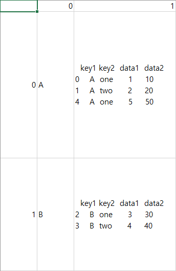
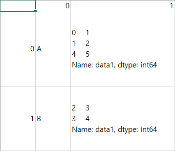

# ML/DL

데이터값을 카테고리 값으로 변환
- pd.cut(data,bins,labels)
    - data : 관측 데이터
    - bins : 번주의 경계값
        - 구간최소값 < 데이터 <= 구간최대값
    - labels: 범주명
    - 경계값을 기준으로 데이터를 범주화시킴
        - data=[0,0.5,4,6]
        - bins=[0,4,18]
        - labels['영유아','미성년자']
        - pd.cut(data,bins,labels) = [NaN, '영유아', '영유아', '미성년자']
        - 0값은 어떤 범주에도 속할 수 없기 때문에 NaN으로반환('영유아': 0 < data <= 4)

- pd.qcut(data,구간수,labels)
    - 구간수를 기준으로 데이터를 범주화시킴
        - data=[0,0.5,4,6]
        - bins=2
        - labels['영유아','미성년자']
        - pd.qcut(data,bins,labels) = ['영유아', '영유아', '미성년자', '미성년자']
        - 전체를 2개의 범주로 나눔

- df1.merge(df2) = pd.merge(df1,df2)
    - how = 'inner/outer/left/right'
    - on
        - left_on / right_on
    - left_index / right_index
    - merge 대신 join 메서드 사용가능

- pd.concat([df1,df2, ...], axis=0, join='outer', ignore_index=False, keys=None)
    - axis
        - 0: 위+아래로 합치기 / 1: 왼쪽+오른쪽으로 합치기
    - join
        - 'outer' / 'inner'
    - ignore_index - 기존 인덱스 무시 여부
    - keys=['key1', 'key2', ...] - concat 테이블에 df1,df2,... 테이블을 기준으로 key1,key2,... 멀티인덱스 사용
    
- pd.pivot_table(data, values=None, index=None, columns=None, aggfunc='mean', fill_value=None, margins=False, margine_name=''All)
    - data: 분석할 데이터 프레임. 메서드 형식일때는 필요하지 않음(df1.pivot_table())
    - values: 데이터 프레임에서 분석할 열
    - index: 행 인덱스로 들어갈 키열 또는 키열의 리스트
    - columns: 열 인덱스로 들어갈 키열 또는 키열의 리스트
    - aggfunc: values에 적용할 함수
    - fill_value: NaN이 표출될 때 대체값 지정
    - margins: 모든 데이터를 분석한 결과를 행으로 표출할 지 여부
    - margins_name: margins가 표출될 때 그 열(행)의 이름

- pd.groupby(DataFrame)
    - pd.groupby('컬럼명1')['컬럼명2'].함수()
        - 컬럼명1을 기준으로 그룹화하여 컬럼명2에 대해 함수적용
        - '컬럼명1' ==(같은 표현) df.컬럼명1
        - ['컬럼명2'] == .컬럼명2 사용가능
            - DataFrame 추출표현임 - 추출방식이 다름
            - groups = pd.groupby()
            - pd.DataFrame(groups)

                

            - pd.DataFrame(groups['data1']) 

                

    - pd.groupby('컬럼명1')['컬럼명2'].함수() == pd.groupby('컬럼명1').함수()['컬럼명2']

---
[실습](http://localhost:8888/tree/pandas_0712)